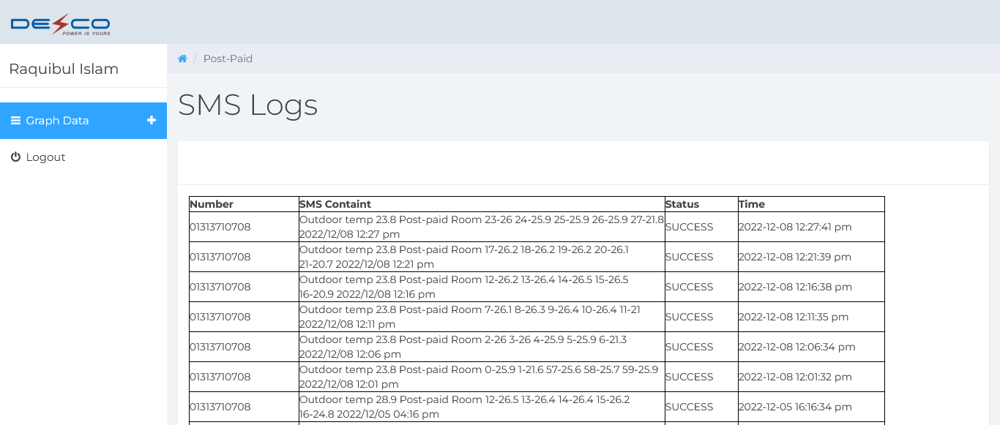

# Rtmons - Remote Temperature Monitoring System

A robust temperature monitoring system built to prevent server downtime by monitoring AC performance in server rooms with real-time alerts via SMS.

## 🚨 Problem Statement

Four years ago, our infrastructure consisted of two server rooms without a proper data center. Each room had 2 AC units controlled by microcontrollers, running in 4-hour cycles. AC failures would lead to rapid temperature increases causing server shutdowns and potential hardware damage.

## 💡 Solution

Tmons (Temperature Monitor) - A custom-built monitoring system that:
- Continuously monitors room temperature using NodeMCU and DHT22 sensors
- Provides real-time remote monitoring through a web interface
- Sends immediate SMS alerts via company SMS gateway when temperatures exceed thresholds
- Ensures 24/7 server room climate stability

## 🛠 Hardware Components

- **NodeMCU ESP8266** - WiFi-enabled microcontroller
- **DHT22** - High-precision temperature and humidity sensor
- **OLED 128x32 Display** - Local temperature display
- **Power Supply** - Stable 5V power source
- **Enclosure** - Protective casing for electronics

## 💻 Software Stack

- **Frontend**: HTML5, CSS3, JavaScript
- **Backend**: PHP
- **Database**: SQLite
- **Microcontroller**: Arduino C++ (NodeMCU)
- **SMS Integration**: SMS Gateway

## 📱 Web Interface Pages

### 1. Dashboard (Home)

*Real-time overview of both server rooms with current temperature, humidity, and system status*

### 2. Room 1 Details

*Detailed view of Room 1 with historical data, temperature trends, and AC status*

### 3. Room 2 Details  

*Detailed view of Room 2 with historical data, temperature trends, and AC status*

### 4. System Settings

*Configuration panel for temperature thresholds, SMS alerts, and system parameters*

### 5. SMS Logs

*Complete history of all SMS notifications sent by the system*

## 🔌 Schematic Diagram

*Electrical wiring diagram for NodeMCU, DHT22, and OLED display connections*

## 📸 Physical Device

*Actual implementation of the monitoring unit in server room environment*

## ⚙️ Installation & Setup

### Hardware Setup
1. Connect DHT22 to NodeMCU (VCC, GND, Data)
2. Connect OLED display to NodeMCU via I2C
3. Upload Arduino code to NodeMCU
4. Configure WiFi credentials in the firmware

### Software Setup
1. Deploy PHP files to web server
2. Configure SQLite database path
3. Set up SMS gateway integration
4. Configure temperature thresholds in settings

## 🚀 Features

- **Real-time Monitoring**: Live temperature and humidity tracking
- **SMS Alerts**: Instant notifications when thresholds are breached
- **Historical Data**: Temperature trends and history
- **Remote Access**: Web-based monitoring from anywhere
- **Multi-room Support**: Simultaneous monitoring of multiple locations
- **Low Power Consumption**: Energy-efficient operation

## 📊 Alert Thresholds

- **Warning**: >20°C - SMS notification sent
- **Critical**: >27°C - Immediate action required
- **AC Failure Detection**: Rapid temperature rise detection

## 🔧 Configuration

Key configuration parameters in `settings.php`:
- Temperature thresholds
- SMS recipient numbers
- Data logging intervals
- SMS gateway settings

## 📈 Impact

- **100%** prevention of temperature-related server downtime
- **Immediate** response to AC failures
- **24/7** remote monitoring capability
- **Cost-effective** solution compared to commercial systems

## 👨‍💻 Developer

Developed by Raquibul Islam(@ranacse05) to solve critical infrastructure monitoring challenges in our server rooms.

---

*Reliable temperature monitoring that prevented countless server outages and hardware failures.*
